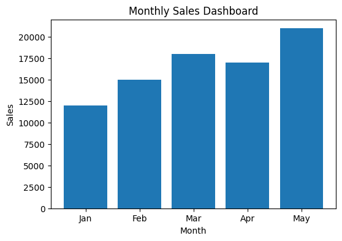

# Excel Sales Dashboard

## Project Overview
This project analyzes monthly sales data and presents business insights through an interactive Excel dashboard.

The dashboard helps identify:
- Monthly sales trends
- High-performing months
- Business growth patterns
- Data-driven insights

---

## Tools Used
- Microsoft Excel
- Pivot Tables
- Charts & Visualizations
- Business Analytics

---

## Project Files
- Sales_Dashboard.xlsx
- Project_Report.pdf
- Project_Presentation.pptx

---

## Dashboard Preview

---

## Key Insights
- Sales showed continuous growth across months.
- Visual dashboards improved reporting clarity.
- Data analysis supports better business decision-making.

---

## Conclusion
This project demonstrates my ability to work with business data, create dashboards, and present insights using Excel analytics tools.# excel-sales-dashboard
Sales analysis dashboard project using Excel with business insights and visualizations.
